# Laboratório 1 - Base de dados: Detecção de Fraudes

## Objetivo
Este projeto tem como objetivo construir um pipeline de engenharia de dados utilizando a arquitetura em camadas (Raw, Bronze, Silver e Gold), com foco na ingestão, tratamento e preparação de dados de transações de cartão de crédito para análise de fraudes.

## Dataset
- Fonte: Kaggle  
- Dataset: Credit Card Fraud Detection  
- Arquivo utilizado: train.csv  
- Volume: 1.296.675 linhas e 23 colunas  

O dataset contém informações sobre transações financeiras, incluindo dados do cliente, localização, valor da transação e indicação de fraude.

## Arquitetura do Projeto
A solução foi construída em pipeline com camadas Bronze, Silver e Gold. Os dados brutos são ingeridos no PostgreSQL, tratados na camada Silver e posteriormente modelados na camada Gold em um Star Schema. A modelagem consiste em uma tabela fato de transações conectada a dimensões de cliente, tempo, categoria, merchant e localização. Essa estrutura permite análises eficientes e suporte à geração de métricas de negócio.

## Preparação do Ambiente

Para execução do projeto, foram realizadas as seguintes etapas iniciais:

- Download do dataset a partir do Kaggle  
- Armazenamento do arquivo na pasta `data/raw`  
- Criação da estrutura de diretórios do projeto  
- Configuração do ambiente virtual Python  

Essas etapas não fazem parte do pipeline de dados, mas são necessárias para sua execução.

## Etapas do Pipeline

### 1. Ingestão (Bronze)
Os dados foram carregados da camada Raw para a Bronze sem qualquer modificação, respeitando o princípio de integridade dos dados.

Script:
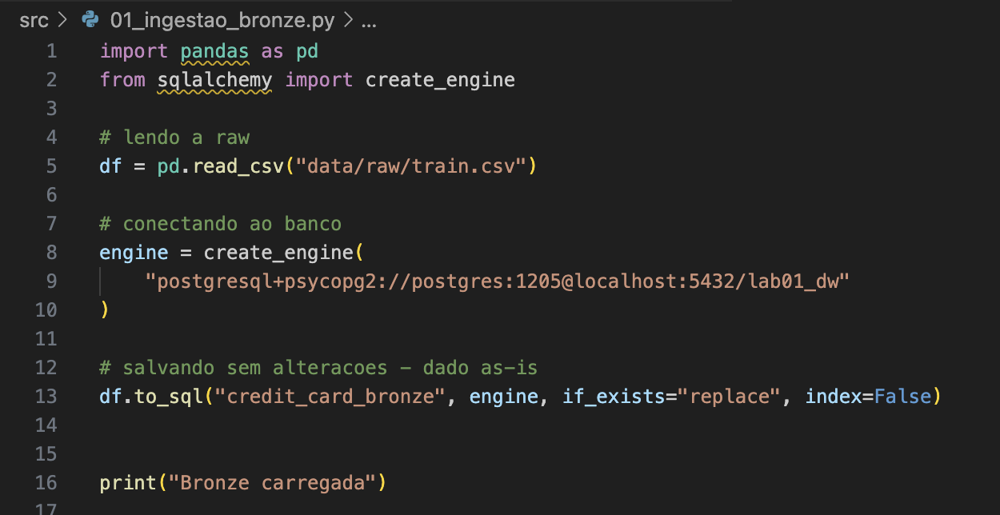

Resultado:
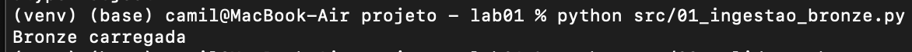

### 2. Validação
Foi realizada a validação para garantir que os dados na Bronze são idênticos aos da Raw.

Script:
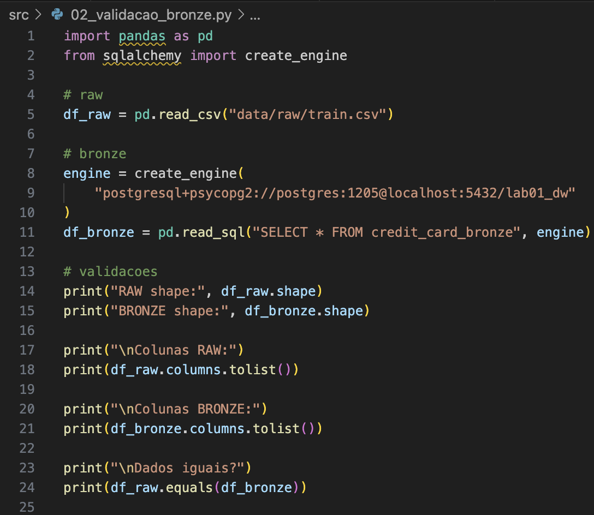

Resultado:
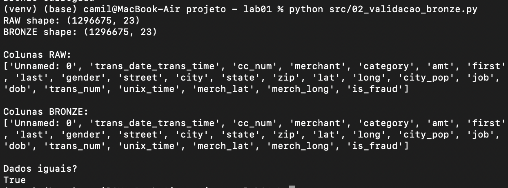

### 3. Tratamento (Silver)

Resultado:
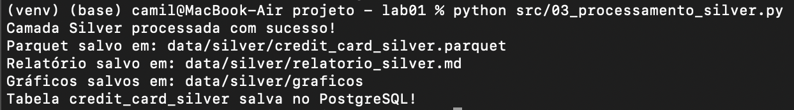

Problemas Identificados:
- Coluna irrelevante (`unnamed_0`) removida por não possuir valor analítico.
- Tipos de dados inconsistentes (datas como string) corrigidos para datetime.
- Ausência de nulos e duplicatas, porém sem validação semântica dos dados.
- Presença de outliers na variável de valor (`amt`).
- Dados sensíveis presentes (nome, endereço, cartão), sem anonimização.

## Gráficos gerados

<<<<<<< HEAD
### Top 10 cidades com mais transações
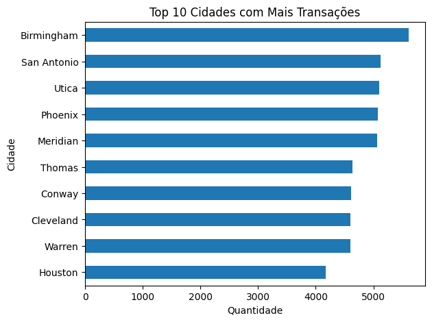

### Top 10 estados com mais transações
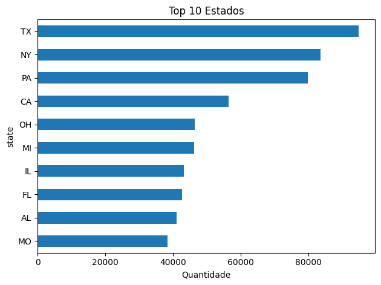
=======
#Top 10 cidades com mais transações:

Top 10 estados com mais transações:

>>>>>>> e24b88f (correcao readme.md)

### Valor das transações

<<<<<<< HEAD
**Obs:** A escala logarítmica é usada para reduzir a diferença entre valores muito pequenos e muito grandes, permitindo visualizar melhor a distribuição dos dados.

### Categorias de compras com maior índice de fraude
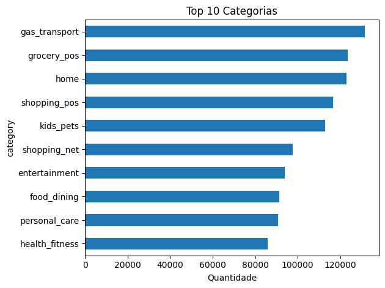

### Proporção de fraudes por gênero
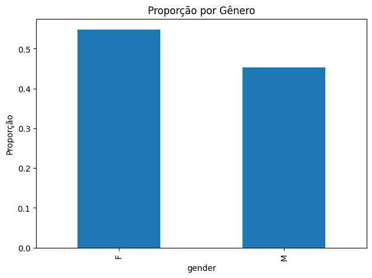
=======
  

  
Obs: A escala logarítmica é usada para reduzir a diferença entre valores muito pequenos e muito grandes, permitindo visualizar melhor a distribuição dos dados.

Categorias de compras com maior indice de fraude:

Proporção de fraudes por gênero:

>>>>>>> e24b88f (correcao readme.md)

### 4. Business (Gold)
A camada Gold foi modelada em formato Star Schema, com uma tabela fato central (fato_transacoes) e cinco dimensões analíticas (dim_tempo, dim_cliente, dim_categoria, dim_merchant e dim_localizacao). O objetivo dessa modelagem é facilitar consultas de negócio relacionadas ao comportamento transacional e à detecção de fraudes.

O processamento Gold é responsável pela modelagem e estruturação dos dados, enquanto o script de métricas consome a camada Gold para gerar insights de negócio.

Execução processamento gold:
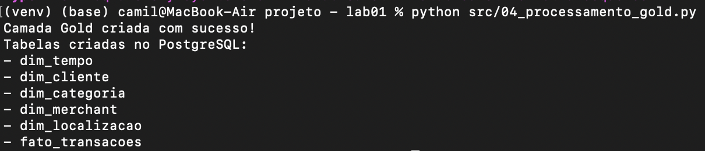

Execução métricas gold:
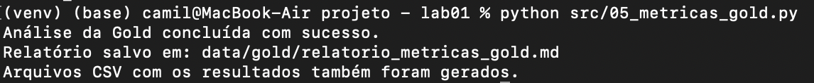

  
### Perguntas de negócio respondidas

1. Qual estado teve a maior taxa de fraude?  

O estado com maior taxa de fraude, considerando apenas estados com volume relevante de transações, foi **Alasca**. Foram registradas **36 fraudes** em **2120 transações**, o que representa uma taxa de **1.7%**, equivalente a aproximadamente **17.0 fraudes por mil transações**.

2. Qual categoria teve o maior valor total fraudado?  

A categoria com maior impacto financeiro em fraudes foi **Shopping Net**. Ela acumulou **1713 transações fraudulentas**, totalizando **US$ 1.711.723,71** em valor fraudado, com um ticket médio de **US$ 999,25** por transação fraudulenta.

3. Em qual faixa etária a taxa de fraude é maior?  

A faixa etária com maior taxa de fraude foi **De 55 a 64 anos**. Nesse grupo, ocorreram **1259 fraudes** em **164087 transações**, resultando em uma taxa de **0.77%**, o equivalente a aproximadamente **7.7 fraudes por mil transações**.

4. Em qual horário do dia acontecem mais fraudes?  

O horário com maior taxa de fraude foi **22:00**. Nesse período, foram registradas **1931 fraudes** em **66982 transações**, equivalendo a **2.88%**, ou aproximadamente **28.8 fraudes por mil transações**.

5. Qual foi o dia da semana com maior taxa de fraude?  

O dia da semana com maior taxa de fraude foi **Sexta-Feira**. Nesse dia, foram registradas **1079 fraudes** em **152272 transações**, o que corresponde a **0.71%**, ou aproximadamente **7.1 fraudes por mil transações**.

## Dicionário de Dados
Cada linha representa uma transação de cartão de crédito.

| Coluna                   | Tipo      | Descrição |
|--------------------------|----------|----------|
| Unnamed: 0              | Inteiro  | Índice do registro no dataset original |
| trans_date_trans_time   | String   | Data e hora da transação |
| cc_num                  | Inteiro  | Número do cartão de crédito do cliente |
| merchant                | String   | Nome do estabelecimento onde ocorreu a transação |
| category                | String   | Categoria do estabelecimento (ex: food, shopping, etc.) |
| amt                     | Float    | Valor da transação |
| first                   | String   | Primeiro nome do cliente |
| last                    | String   | Sobrenome do cliente |
| gender                  | String   | Gênero do cliente |
| street                  | String   | Endereço do cliente |
| city                    | String   | Cidade do cliente |
| state                   | String   | Estado do cliente |
| zip                     | Inteiro  | CEP do cliente |
| lat                     | Float    | Latitude da localização do cliente |
| long                    | Float    | Longitude da localização do cliente |
| city_pop                | Inteiro  | População da cidade do cliente |
| job                     | String   | Profissão do cliente |
| dob                     | String   | Data de nascimento do cliente |
| trans_num               | String   | Identificador único da transação |
| unix_time               | Inteiro  | Timestamp da transação em formato Unix |
| merch_lat               | Float    | Latitude do estabelecimento |
| merch_long              | Float    | Longitude do estabelecimento |
| is_fraud                | Inteiro  | Indica se a transação é fraude (1) ou não (0) |

## Instruções de execução

### Pré-requisitos:
- PostgreSQL instalado e em execução
- Banco de dados `lab01_dw` criado
- Acesso configurado com usuário e senha no código

### 1. Instalação das dependências  

Antes de executar o projeto, é necessário instalar as bibliotecas utilizadas:

pip install -r requirements.txt

### 2. Ordem de execução dos scripts  

Os scripts devem ser executados na seguinte ordem, respeitando a sequência do pipeline de dados:

python src/01_ingestao_bronze.py
python src/02_validacao_bronze.py
python src/03_processamento_silver.py
python src/04_processamento_gold.py
python src/05_metricas_gold.py

### 3. Descrição das etapas  

- 01_ingestao_bronze.py
Realiza a ingestão dos dados brutos (CSV) para o PostgreSQL, criando a camada Bronze.
- 02_validacao_bronze.py
Valida se os dados carregados na Bronze estão consistentes com a fonte original.
- 03_processamento_silver.py
Realiza limpeza, padronização e tratamento dos dados, gerando a camada Silver.
- 04_processamento_gold.py
Aplica modelagem dimensional (Star Schema), criando tabelas fato e dimensões na camada Gold.
- 05_metricas_gold.py
Executa consultas analíticas na Gold e gera métricas de negócio e relatórios.

### 4. Resultado  

Ao final da execução, o usuário recebe um relatório analítico com os principais padrões de fraude identificados.

### Observação  
Os arquivos de dados utilizados no projeto (dataset original e arquivos `.parquet`) não foram versionados no repositório devido a limitações de tamanho do GitHub.

Essa decisão segue boas práticas de engenharia de dados, onde arquivos volumosos devem ser armazenados em soluções apropriadas (como data lakes ou armazenamento externo), e não diretamente no controle de versão.

