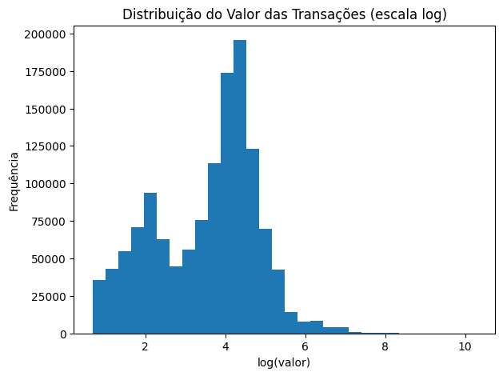
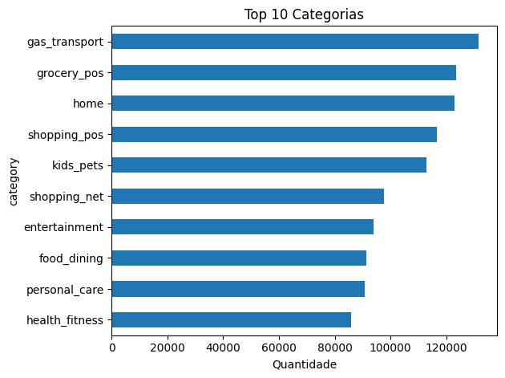
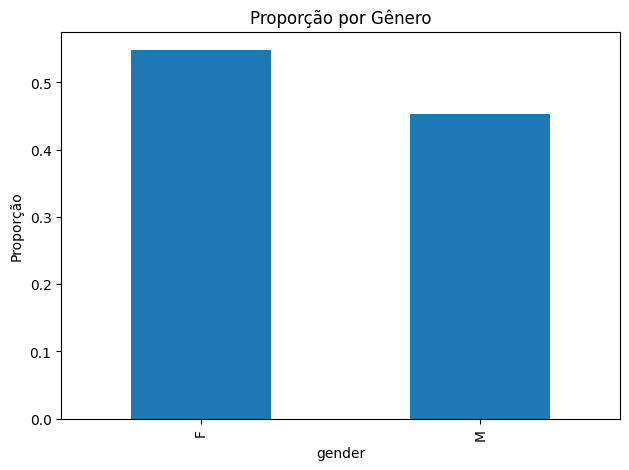
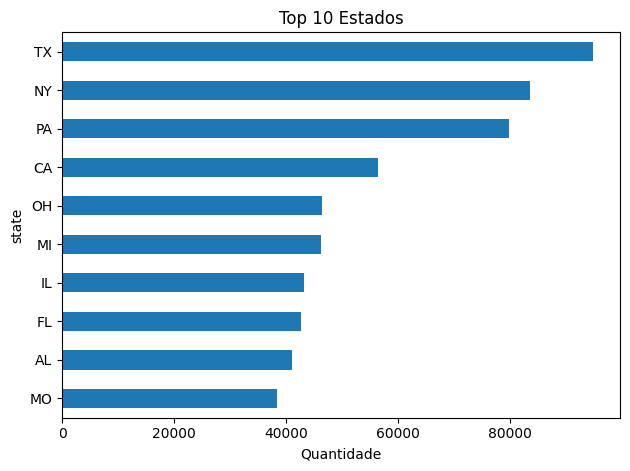

# Relatório da Camada Silver

## 1. Visão Geral

- Linhas antes da limpeza: 1296675
- Colunas antes da limpeza: 23
- Linhas após a limpeza: 1296675
- Colunas após a limpeza: 22
- Duplicatas removidas: 0

## 2. Tipos das Colunas

|                       | tipo    |
|:----------------------|:--------|
| Unnamed: 0            | int64   |
| trans_date_trans_time | str     |
| cc_num                | int64   |
| merchant              | str     |
| category              | str     |
| amt                   | float64 |
| first                 | str     |
| last                  | str     |
| gender                | str     |
| street                | str     |
| city                  | str     |
| state                 | str     |
| zip                   | int64   |
| lat                   | float64 |
| long                  | float64 |
| city_pop              | int64   |
| job                   | str     |
| dob                   | str     |
| trans_num             | str     |
| unix_time             | int64   |
| merch_lat             | float64 |
| merch_long            | float64 |
| is_fraud              | int64   |

## 3. Contagem de Nulos Antes da Limpeza

|                       |   nulos |
|:----------------------|--------:|
| Unnamed: 0            |       0 |
| trans_date_trans_time |       0 |
| cc_num                |       0 |
| merchant              |       0 |
| category              |       0 |
| amt                   |       0 |
| first                 |       0 |
| last                  |       0 |
| gender                |       0 |
| street                |       0 |
| city                  |       0 |
| state                 |       0 |
| zip                   |       0 |
| lat                   |       0 |
| long                  |       0 |
| city_pop              |       0 |
| job                   |       0 |
| dob                   |       0 |
| trans_num             |       0 |
| unix_time             |       0 |
| merch_lat             |       0 |
| merch_long            |       0 |
| is_fraud              |       0 |

## 4. Estatísticas Descritivas

|                       |       count |        unique | top                              |   freq |             mean |              std |            min |              25% |              50% |              75% |             max |
|:----------------------|------------:|--------------:|:---------------------------------|-------:|-----------------:|-----------------:|---------------:|-----------------:|-----------------:|-----------------:|----------------:|
| Unnamed: 0            | 1.29668e+06 | nan           | nan                              |    nan | 648337           | 374318           |    0           | 324168           | 648337           | 972506           |     1.29667e+06 |
| trans_date_trans_time | 1.29668e+06 |   1.27479e+06 | 2019-04-22 16:02:01              |      4 |    nan           |    nan           |  nan           |    nan           |    nan           |    nan           |   nan           |
| cc_num                | 1.29668e+06 | nan           | nan                              |    nan |      4.17192e+17 |      1.30881e+18 |    6.04162e+10 |      1.80043e+14 |      3.52142e+15 |      4.64226e+15 |     4.99235e+18 |
| merchant              | 1.29668e+06 | 693           | fraud_Kilback LLC                |   4403 |    nan           |    nan           |  nan           |    nan           |    nan           |    nan           |   nan           |
| category              | 1.29668e+06 |  14           | gas_transport                    | 131659 |    nan           |    nan           |  nan           |    nan           |    nan           |    nan           |   nan           |
| amt                   | 1.29668e+06 | nan           | nan                              |    nan |     70.351       |    160.316       |    1           |      9.65        |     47.52        |     83.14        | 28948.9         |
| first                 | 1.29668e+06 | 352           | Christopher                      |  26669 |    nan           |    nan           |  nan           |    nan           |    nan           |    nan           |   nan           |
| last                  | 1.29668e+06 | 481           | Smith                            |  28794 |    nan           |    nan           |  nan           |    nan           |    nan           |    nan           |   nan           |
| gender                | 1.29668e+06 |   2           | F                                | 709863 |    nan           |    nan           |  nan           |    nan           |    nan           |    nan           |   nan           |
| street                | 1.29668e+06 | 983           | 864 Reynolds Plains              |   3123 |    nan           |    nan           |  nan           |    nan           |    nan           |    nan           |   nan           |
| city                  | 1.29668e+06 | 894           | Birmingham                       |   5617 |    nan           |    nan           |  nan           |    nan           |    nan           |    nan           |   nan           |
| state                 | 1.29668e+06 |  51           | TX                               |  94876 |    nan           |    nan           |  nan           |    nan           |    nan           |    nan           |   nan           |
| zip                   | 1.29668e+06 | nan           | nan                              |    nan |  48800.7         |  26893.2         | 1257           |  26237           |  48174           |  72042           | 99783           |
| lat                   | 1.29668e+06 | nan           | nan                              |    nan |     38.5376      |      5.07581     |   20.0271      |     34.6205      |     39.3543      |     41.9404      |    66.6933      |
| long                  | 1.29668e+06 | nan           | nan                              |    nan |    -90.2263      |     13.7591      | -165.672       |    -96.798       |    -87.4769      |    -80.158       |   -67.9503      |
| city_pop              | 1.29668e+06 | nan           | nan                              |    nan |  88824.4         | 301956           |   23           |    743           |   2456           |  20328           |     2.9067e+06  |
| job                   | 1.29668e+06 | 494           | Film/video editor                |   9779 |    nan           |    nan           |  nan           |    nan           |    nan           |    nan           |   nan           |
| dob                   | 1.29668e+06 | 968           | 1977-03-23                       |   5636 |    nan           |    nan           |  nan           |    nan           |    nan           |    nan           |   nan           |
| trans_num             | 1.29668e+06 |   1.29668e+06 | 0b242abb623afc578575680df30655b9 |      1 |    nan           |    nan           |  nan           |    nan           |    nan           |    nan           |   nan           |
| unix_time             | 1.29668e+06 | nan           | nan                              |    nan |      1.34924e+09 |      1.28413e+07 |    1.32538e+09 |      1.33875e+09 |      1.34925e+09 |      1.35939e+09 |     1.37182e+09 |
| merch_lat             | 1.29668e+06 | nan           | nan                              |    nan |     38.5373      |      5.10979     |   19.0278      |     34.7336      |     39.3657      |     41.9572      |    67.5103      |
| merch_long            | 1.29668e+06 | nan           | nan                              |    nan |    -90.2265      |     13.7711      | -166.671       |    -96.8973      |    -87.4384      |    -80.2368      |   -66.9509      |
| is_fraud              | 1.29668e+06 | nan           | nan                              |    nan |      0.00578865  |      0.0758627   |    0           |      0           |      0           |      0           |     1           |

## 5. Contagem de Nulos Após a Limpeza

|                       |   nulos |
|:----------------------|--------:|
| trans_date_trans_time |       0 |
| cc_num                |       0 |
| merchant              |       0 |
| category              |       0 |
| amt                   |       0 |
| first                 |       0 |
| last                  |       0 |
| gender                |       0 |
| street                |       0 |
| city                  |       0 |
| state                 |       0 |
| zip                   |       0 |
| lat                   |       0 |
| long                  |       0 |
| city_pop              |       0 |
| job                   |       0 |
| dob                   |       0 |
| trans_num             |       0 |
| unix_time             |       0 |
| merch_lat             |       0 |
| merch_long            |       0 |
| is_fraud              |       0 |

## 6. Limpezas Realizadas

- Padronização dos nomes das colunas para snake_case.
- Remoção da coluna 'unnamed_0' por aparentar ser um índice sem valor analítico.
- Conversão das colunas de data para datetime.
- Tratamento de valores ausentes por imputação.
- Remoção de registros duplicados.
- Salvamento final em formato Parquet.
- Salvamento da camada Silver no PostgreSQL.

## 7. Gráficos

### 7.1 Top 10 Cidades com Mais Transações

### 7.2 Distribuição do Valor das Transações

### 7.3 Top 10 Categorias

### 7.4 Distribuição por Gênero

### 7.5 Top 10 Estados

## 8. Problemas Identificados

- A coluna 'unnamed_0' aparenta ser um índice e pode ser removida.
- A coluna 'trans_date_trans_time' foi convertida para datetime para facilitar análises temporais.
- A coluna 'dob' foi convertida para datetime.
- Não foram encontradas linhas duplicadas.
